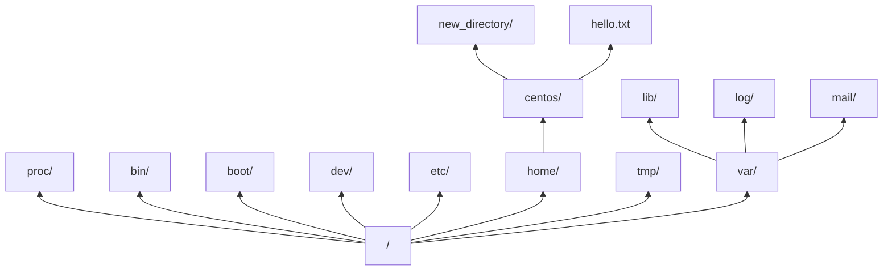
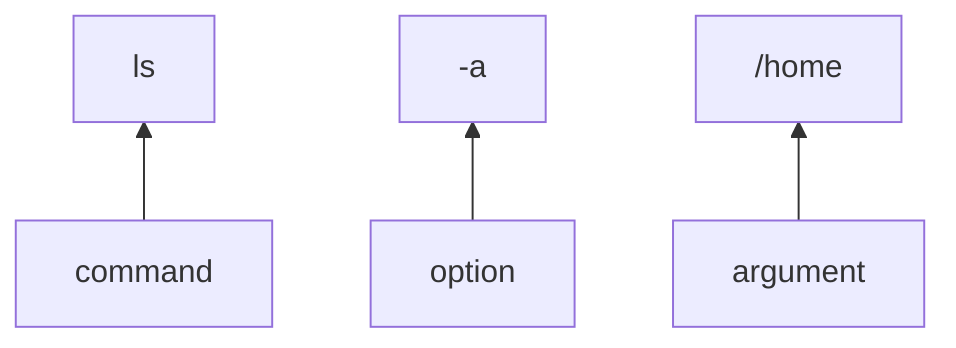

# Commanding Linux

## Summary

### Objectives

*By the end of this session you should be able to:*

* Connect to a Linux server using an SSH Client
* Explain the structure of a command
* Navigate the Linux filesystem

### Key Points

* The most common way to control a Linux server is using a Command Line Interface
* The most common way to connect to remote Linux server’s CLI is using an SSH Client
* Commands in Linux can take arguments, which are information given to the command
* Linux has a unified filesystem layout which can be explored from the command line

## Breakdown

### Interfacing with a computer

There are many ways to interface with a computer. These include:

* **Graphical User Interfaces** (GUI), often controlled with some sort of pointer (a finger or a mouse), use graphics to invite input (buttons, sliders, gestures, etc) and provide highly engaging output.
* **Voice User Interfaces** (VUI), controlled with your voice, attempt to provide a "conversational" way to ask your computer to take actions.
* **Command Line Interfaces** (CLI), controlled with a keyboard, invite you to type out commands - and present output as unformatted text.

CLIs are daunting for inexperienced users, but they are actually relatively intuitive - once you know the right commands, that is. Command Line Interfaces are far more efficient, and experienced users can do things faster with a CLI than with a GUI. CLIs are much easier to script, too - meaning you can use programming skills to automate commands.

### Connecting to remote computers

So far, you may have used computers *locally* - that is, computers that are physically near to you - and so you are used to fast connections that allow Graphical User Interfaces to shine. However, most Systems Administrators work on computers *remotely* - computers that are not close, and may even be on different continents! This is one of the reasons Sysadmins tend to use Command Line Interfaces instead - they are very fast and efficient!

Secure Shell (SSH) is a common protocol for connecting to remote computers. The remote computers run an SSH Server, which can be connected to by anyone with the correct username (and password) and an SSH Client. On computers with CLI SSH clients, the syntax for connecting to a remote server is:

```shell
ssh <username>@<address>
```

Where the `<username>` is the username that exists on the remote computer, and the `<address>` is the IP or DNS address of the computer.

### The Linux Filesystem



A filesystem is simply a way of arranging files such that they can be accessed easily. The simplest filesystem would be a collection of files with unique names, but most filesystems arrange files inside different folders (called *directories* in Linux). We can represent a directory by placing a `/` at the end of it.

The Linux filesystem is a *unified* filesystem, which means all files and directories are part of the same tree. This is different from Windows, where there is a filesystem per disk (e.g. `C:`, `D:`, `A:`) - on Linux, everything starts at the *root directory*, which is represented by a `/`. Disks are "mounted" on different parts of the tree - e.g. everything on `/` might be on one disk, but the files under `/home` might be on a different disk.

When working on the Linux command line, you are always inside a directory on the filesystem - you can check which one with the `pwd` command, and you can change directories with the `cd` command. When referencing a directory you can either use a *relative* path (so called because it's relative to where you currently are), or an *absolute* path (which is always relative to the root, `/`). Relative paths will change based on where you are on the filesystem.

:::info
The *Filesystem Hierarchy Standard* defines the directory structure of most Linux distributions, so learning it can be helpful. The graph above follows part of the standard.
:::

### Linux Commands

Linux commands are made up of three parts - the command itself, the command's *options*, and the command's *arguments*. As an example, if we break down the command `ls -a /home` (which lists all files in the directory `/home`):



Commands can have zero or more options and/or zero or more arguments; some commands do not accept options or arguments, others require them. The most reliable way of knowing for each command is to use it's manual, accessible by the `man` command (e.g. `man ls`) - however, these manuals can be hard to understand. An alternative is to just use Google - though remember that information found on the internet may be unreliable or even malicious in nature. **Never copy/paste a command off the internet without understanding it first** - especially at work!

Common Linux commands include:

* `cd`, used for changing directories (e.g. `cd /home` or `cd new_folder`)
* `ls`, used for listing the contents of directories (common options include `-a` (all) and `-l` (long listing))
* `pwd`, used to print the working directory (the directory you're currently "inside" on the terminal)
* `cat`, used to echo the contents of a file (e.g. `cat poem.txt`)
