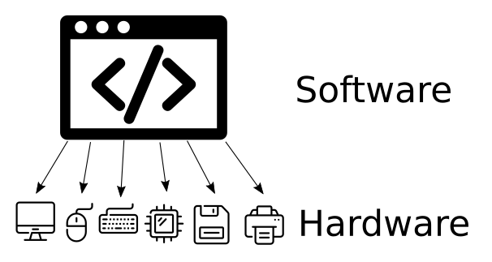
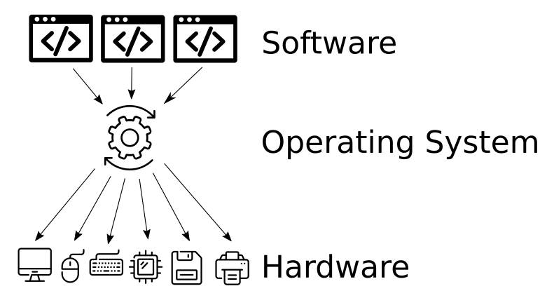

# Linux and you

## Summary

### Objectives

*By the end of this session you should be able to:*

* Explain what operating systems are, and what a kernel is
* Explain what the Linux Kernel is, and what Linux Distributions are

### Key Points

* An Operating System is a piece of software that manages both hardware and software resources, and provides common services for other software to run
* All Operating Systems include a kernel, which handles interactions between hardware and software
* Many distributions of Linux exist, which are all different Operating Systems that use the same Linux kernel
* Linux can be found in most homes, built into smartphones, smart devices, games consoles and network equipment

:::info
In this session we use the concept of an _analogy_ quite extensively. An analogy is a comparison between two things that are similar in some way. When you draw an analogy between two different things, you are comparing them because you want to make a concept easier to understand.
:::

## Breakdown

### What is an operating system?

An Operating System is system software that manages computer hardware, software resources, and provides common services for computer programs.

:::tip
An Operating System is commonly abbreviated as "OS" - pronounced both "Oss" and "Oh-Es".
:::

:::info
Early Operating Systems were people! Early computers were far too expensive to be used by one person - instead, programmers would drop off their programs with Machine Operators (much like you may drop off the post). These people would then schedule and run the programs on the computer, returning the results (on paper) to the programmer.
:::

### Examples of Operating Systems

* **Windows** - a family of Operating Systems built by Microsoft. Designed primarily for desktop, laptop and server computers.
* **Android** - an Operating System *mostly* built by Google. Designed primarily for touchscreen devices like smartphones and tablets.
* **macOS** - an Operating System built by Apple. Designed for desktop, laptop and server computers.
* **iOS/ipadOS/tvOS/watchOS** - a family of Operating Systems based on macOS and built by Apple for their smartphones, tablets, televisions and smartwatches.

### Computers without Operating Systems

Computers can run without an Operating Systems - early computers often did, and very lightweight computers still do.

Programmers can interface with the hardware directly - this can be faster, and result in less bugs. However, the programmer will have to write code for every piece of hardware the program might run on!

The Nintendo Entertainment System (NES) is an example of a computer without an Operating System. Game Developers needed to squeeze every bit of performance from the console, and since every NES used the same hardware it was easier to do so.

### What does an Operating System do?

:::note Analogy
An Operating system is like waiting staff in a restaurant; while a customer could place their order directly with the chef, and the chef could simply bring food out to the table, this quickly breaks down under the stress of more than one or two customers. Waiting staff can queue orders, reserve tables, clean up mess, provide menus and manage resource constraints. Waiting staff allow multiple chefs and multiple customers to efficiently use a restaurant.
:::

#### Hardware Abstraction

An Operating System can *abstract* the hardware from the software. This means programmers don't need to write their software to work with e.g. every make and model of mouse. Instead, hardware manufacturers just write a driver for an Operating System, and the Operating System offers a generic "mouse" for the programmer to write their software to use.

This doesn't just save time when writing software - it also means that as new hardware comes out over time, old software will automatically keep working with it.

#### Common Services

Keeping the time is surprisingly complex - you need to consider everything from timezones to leap seconds. An Operating System can provide this as a service to programmers, who can simply ask for "the time" and not worry about anything else.

This is an example of a service that lots of programs need to operate, but that is quite complex. Users and programmers both prefer to just set the time once. Other examples includ print queues and language preferences.

#### Software management

With the NES, changing programs was as simple as plugging in a new cartridge. Modern computers are more complex; users expect to run multiple programs at once, install programs to the computer directly, update programs, and easily launch them.

Modern Operating Systems provide interfaces to start programs (e.g. the Start Menu), keep track of running programs (e.g. the Taskbar), Install, Update, and Remove programs. Some Operating Systems even come with application stores to buy programs!

### What is Linux?

#### Linux is a Kernel

Linux is an operating system *kernel* - the part of the operating system that handles the interactions between hardware and software components. To create an Operating System you need to combine the kernel with many other tools, created by many different projects.

#### Linux is a family of Operating Systems

Linux is included as part of many operating systems - which we call *distributions* of Linux. However, since these distributions are all quite similar, they are collectively also known as “Linux”.

### Linux Distributions

Each distribution combines the Linux Kernel with all the tools required to provide a useful Operating System. Each Linux Distribution is an Operating System.

Different distributions bundle different software, and configure that software differently by default. This may be for philosophical reasons, to target different applications, or simply because engineers disagree on the best way to fix a problem. However, most distributions share the similar fundamentals.

Linux Distributions you may have heard of include Ubuntu, Red Hat Enterprise Linux, Fedora, Arch, Manjaro and CentOS.

:::note Analogy
Linux is like an engine; an engine needs to take inputs (fuel, acceleration, etc) and apply an output (power). An engine could be placed in lots of different cars, and alongside lots of different components, to make many different cars with different strengths and weaknesses. The cars are like distributions.
:::
