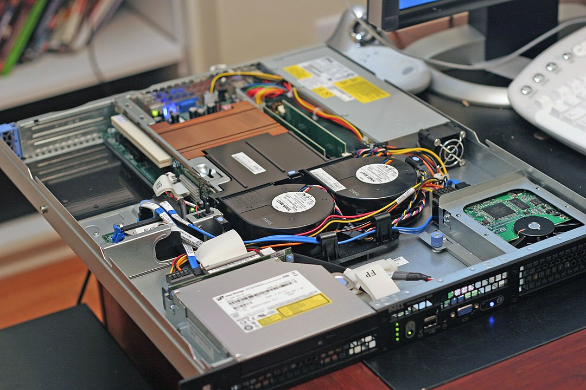

# Servers

## Summary

### Objectives
*By the end of this session you should be able to:*
* Explain what a “server” is, and how it contrasts with other types of computer
* Explore common Linux server software

### Key Points
* A server is a computer that runs server software; in comparison to a desktop, they generally have no mouse, keyboard or monitor and are managed remotely
* Common Linux server software includes Apache httpd, MySQL and WordPress

## Breakdown
### WordPress
WordPress is a very popular piece of software used for hosting websites. It is built on a "stack" of other pieces of software called the LAMP stack. LAMP is an acronym that stands for:
* Linux - the Open Source Operating System.
* Apache httpd - an Open Source Web Server.
* MySQL - an Open Source Database Server.
* PHP - a Programming Language.

Installing, configuring and maintaining WordPress is a good way to develop and practice System Adminstration skills.

### Servers
"Server" refers to two distinct things:
* A piece of software that provides a service - e.g. a Web Server, which provides a website service.
* A computer specifically designed for running server software.

*This image by "Rodzilla" at English Wikipedia is licensed under CC-BY-2.5*

Consider this image of a typical computer designed to run a web server. Notable features include:
* A "slab-like" design, which allows it to be mounted with other servers in a rack.
* A monitor connection at the front of the computer, which allows a monitor to be connected for troubleshooting (in normal operation, servers do not usually have monitors attached).
* Loud fans and large holes which allow for lots of air-flow and cooling of components.
* Easily removable components and a "sliding" removal design, allowing for quick repair and maintenance.

This computer would be impractical for home use. However, it still has the same *components* as a home computer - there is nothing technically restricting it from being used as a desktop computer. There is also nothing stopping people from running server software on a desktop computer - and many people do!