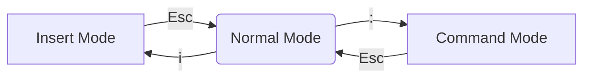

# Working with text

## Summary

### Objectives

*By the end of this session you should be able to:*

* View and scroll text files in the terminal
* Search text files for matching strings
* Define what Regular Expressions are
* Edit text files with Vim

## Breakdown

### Less

The simplest way of viewing a file in the terminal is the `cat` command - type `cat <filename>` and the contents will echo out to the screen. However, the `less` command has a useful feature - the ability to scroll. You can use the up and down keys, or the `Home`,`End`, `PgUp` and `PgDn` keys to move around the file. Press `q` to quit.

Less also allows you to search through files - press `/` then type your search string, and then press enter. Typing `/` and enter will search for the next match of the same search string.

### Grep

Grep allows us to search through files from the terminal, without opening the files themselves. Simply type `grep <search term> <filename>` and it will print out any lines from the file that match the string. Grep has a bunch of handy options, too - e.g. the `-c` option will count the number of times the search term appears instead of printing the lines.

### Vim

While Less is a text viewer, and grep is a text search tool, Vim is a text editor. Many engineers swear by Vim and use it as their primary editor. It's also installed on almost every Linux computer by default, so if you want to edit a text file it's worth knowing.

Vim always starts out in what is called "normal mode"; in this mode you can view a file (as well as do some advanced editing). To insert text into the file you need to press `i`, at which point you can type and delete text as comfortable. Exit insert mode with `Esc`.

Vim also has a command mode, which is entered with the `:` key. Leaving the command mode happens automatically after running a command, or whenever you press `Esc`. From the command mode we can do a couple of things:

* `:w` will save (write) the file.
* `:q` will quit the editor.
* `:/<search term>` will search the file for a term.
* `:%s/<search term>/<replacement string>/g` will search for a term, then replace it where it finds it with the replacement string.

We are only scratching the surface of the power of the Vim text editor; these few commands should give you what you need to move around the editor and get basic work done.

### Regular Expressions (RegEx)

Grep and Vim both support *Regular Expressions* as search terms. Regular Expressions (RegEx) are a powerful tool for making complex searches. Consider the following search terms:

* `[bdf]og` will find the words `bog`, `dog` and `fog`.
* `http:\/\/.*\/` will find any piece of text that starts with `http://` and ends in `/` - any url.
  * `/` is a RegEx character which we *escape* by using the `\` character.
* `^[0-9]` will find any line that starts with a number.

Regular Expressions should be used anywhere you want to find something in a document that's more complex than a simple phrase.
