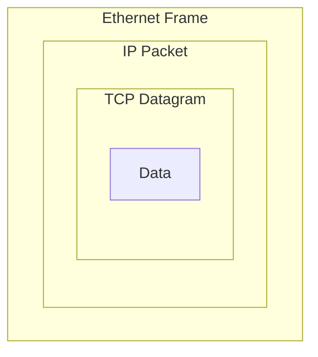

# Routing

## Summary

### Objectives

*By the end of this session you should be able to:*

* Explain how data is moved between different Local Area Networks

### Key Points

* IP addresses are hierarchical addresses that help us in interconnecting networks
* Routing solves the problem of sending data through several local area networks connected together

## Breakdown

### The Internet Protocol

Computers that are *directly* connected to each other can communicate by addressing frames to each others MAC Addresses over the Ethernet Protocol. However, this doesn't work for any computer that isn't directly connected - Ethernet has no *routing* capability, which means frames cannot leave their local domain.

The Internet Protocol allows computers that *aren't* directly connected to each other to send each other data, in *packets*, which can be *routed* between networks until they get to their destination.

### IP Addresses

The Internet Protocol works based on IP Addresses, which are assigned to each computer on a network. IP Addresses are not permanent, and a device may have different IP addresses when it connects to different networks.

IP addresses are 32-bit binary numbers, which are presented in the form of four 8-bit *octets*:

|        IP Address |                     Binary Address |
|-------------------|------------------------------------|
|         `0.0.0.0` | `00000000000000000000000000000000` |
|     `192.168.0.1` | `11000000101010000000000000000001` |
| `255.255.255.255` | `11111111111111111111111111111111` |

:::info
This is a rare case of decimal representation of binary numbers, which are much more commonly represented in hexadecimal. Due to the nature of this representation - four decimal numbers representing a single underlying binary number - performing arithmetic in decimal is very hard.

For this reason many people will convert between decimal and binary when performing calculations on IP Addresses.
:::

### Routing Packets

The Internet Protocol functions by *abstracting* connections between computers from the underlying Ethernet link layer, and is built on top of it. A device will send data wrapped in an IP packet out to the network, wrapped in an Ethernet frame. If the recipient is on the same Ethernet network (e.g. in the same house) then they will receive the frame, unwrap the frame, and then unwrap the packet to get at the data.

If the packet is destined for an external device then it will be sent to the network's *default route*, which is usually a *router*. Routers are computers that are connected to two or more networks, and are in charge of routing packets between them. The router will unwrap the frame, read the packet, then wrap the packet in a new frame destined for the *next hop*.

This will continue until it reaches a router that has a direct connection to the recipient, which it will send the packet to directly.

### Encapsulation

Modern networks are very complex, and only achieve such complexity through *abstraction*. By separating the link layer (Ethernet) and the internet layer (IP) into separate protocols, each can focus on doing their job well while relying on the other to handle other parts of the stack.

As we learn more about networks you will find that data is encapsulated by many different protocols, each building on what came before to provide highly precise, performant and complex systems.
