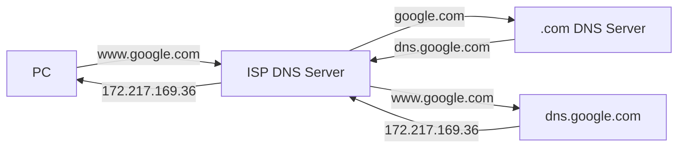

# The Domain Name System

## Summary

### Objectives

*By the end of this session you should be able to:*

* Explain how domain names are resolved to IP addresses on the internet.

### Key Points

* DNS eliminates the need for humans to memorize IP addresses.
* The DNS system is a distributed, decentralised network of servers.
* DNS servers use caches to reduce the number of queries needed.

## Breakdown

### DNS Records

People aren't very good at remembering IP addresses, so a system was created for *resolving* names to IP addresses; this is called the *Domain Name System* (DNS). Anyone can buy a domain name from a domain name registrar, point that domain at an IP address, and then advertise that domain name to other people. When you type in a domain name in the browser, a silent process resolves that to an IP address and then connects to it.

### DNS Servers

The Domain Name System is made up of *authoritative* DNS servers (which know what IP addresses connect to what Domain names) and *recursive* DNS servers (which don't know, but know where to ask). DNS is decentralised, which means that different domain names have different authoritative servers.

When you try to connect to a website using it's domain name, your computer will ask it's configured DNS server (probably your ISP's DNS server) what IP address that domain name resolves to. Your ISP's DNS server will read that domain name from right-to-left, contacting the authoritative DNS server for the root domain (e.g. `.com` or `.org`) asking for the authoritative DNS server for the next entry in the domain name, until it gets a record back (which it returns to you).

### Caching

DNS servers *cache* these requests instead of asking each time, which significantly reduces requests. Your computer does the same. How long the entries are cached depends on the *Time to Live* (TTL) set on the DNS entry, and is different for each one.
