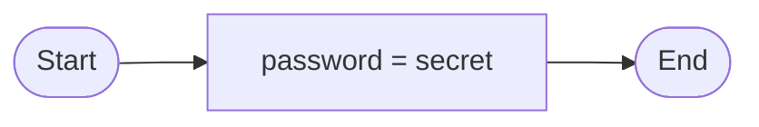

# Drawing flow

## Summary

### Objectives
*By the end of this session you should be able to:*
* Draw out simple applications as flowcharts, using the following symbols:
  * Terminal
  * Flowline
  * Process
  * Input/Output
  * Decision

### Key Points
* Flowcharts are diagrams that represent a workflow or process
  * The specific symbols used the flowchart show the type of instructions
  * Repetition and decisions with branches can be easily represented in a Flowchart

## Breakdown
### Fizz buzz
"Fizz buzz" is a simple children's game that also happens to be a popular programming interview question. The rules are:
* Each player, in turn, counts upwards from 1.
* On your turn:
  * If your number is divisible by 3 you must say "Fizz".
  * If your number is divisible by 5 you must say "Buzz".
  * If your number if divisible by both 3 and 5 you must say "Fizzbuzz".
* Otherwise, you just say your number and play moves to the next player.

### Flowcharts
Flowcharts are diagrams that show a workflow or process. Like programming languages, flowcharts have *syntax* that set out how they work. We start with five basic symbols common to all flowcharts:

#### Terminal

A *terminal* symbol marks the start or end of a flowchart. It is commonly represented as either an oval, or as a rectangle with rounded corners.

#### Flowline

A *flowline* arrow marks the flow from one symbol to the other. In the above chart, the flowline is connecting the Start and End terminals.

#### Process

A *process* symbol represents an instruction that is completed internally. In the above chart, the process is assigning the value `secret` to `password`.

#### Input/Output

An *input/output* symbol represents either input from or output to a user. In the above chart, the input/output symbol is asking for a value to assign to `user_password`.

#### Decision

A *decision* symbol represents a decision that should be made, with each option represented by the writing on the flowlines that run from it. In the above chart, the decision symbol compares the `real_password` and `user_password` to see if they match.