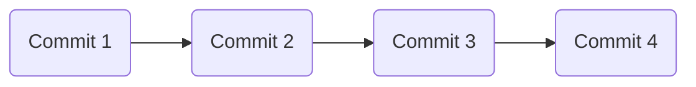
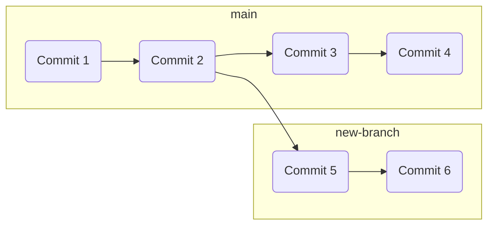
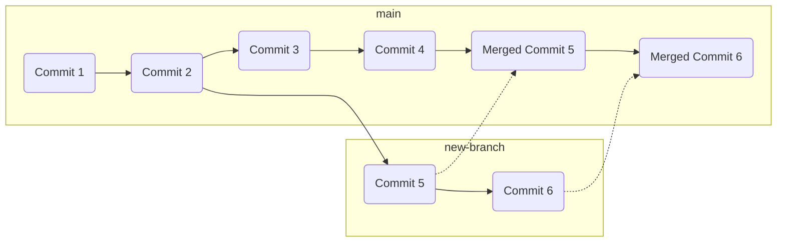

# Git

## Summary

### Objectives

*By the end of this session you should be able to:*

* Demonstrate basic command-line git operations.
* Explain git commits and branches.
* Initialise and commit changes to a git repository.

### Key Points

* Git is a version control system.
* A git-based project, along with all it’s previous versions and branches, is stored in a git repository.
* Git branches allow different people and teams to work on different sets of changes to the same project.
* The git init command creates a new Git repository
* The git branch command lets you create, list, rename, and delete branches.
* The git commit command saves the changes made to the current branch.

### Materials

* [Learn Git Branching](https://learngitbranching.js.org/) is a simulator that helps guide you through a bunch of ways to work with Git.

## Breakdown

### Creating a Git Repository

Git repositories are directories whose contents are being managed by Git. To the user it looks like a standard directory, but it has a special subdirectory (`.git/`) which contains all the "stuff" Git needs to manage versions. You can create a git repository by typing `git init` inside a folder you want Git to manage.

If this is your first time using Git on this computer you will need to use the following commands to tell Git your name and email address:

* `git config --global user.name "Peter Parker"`
* `git config --global user.email "peter@parker.com"`

### Committing files

Once a directory has been initialised as a Git repository, the contents can be added to a *commit*. Git commits can be thought of as snapshots, or *versions*, of the directory which can be rolled back to at any time. To create a first commit out of the current contents of the directory you can use the following commands:

* **`git add <filename>`** will add a file to be *staged* for commit (use the `--all` option to add all files instead of specifying them directly).
* **`git commit`** will create a commit after asking you to give the commit a message (add this directly with the `-m <message>` option).
* **`git status`** will show you the status of the directory in comparison to the current commit, including files that have or haven't yet been staged for the next commit.
* **`git log`** will show you the commit in the current *branch*.

Commits are linked to each other and are layered on top of each other - when you create a commit it will be linked to the previous commit that existed (if any):

### Branching and Merging

To allow for multiple people to work on a project at the same time, as well as to allow individuals to work on multiple different ideas at the same time, Git allows for multiple branches to co-exist. Branches can be listed with the `git branch` command. By default, a repository only has one branch (usually `main`), but you can create a new branch by typing `git checkout -b <new-branch-name>`. Branches are switched between - or, *checked out*" - using `git checkout <branch-name>`.

:::info
The terminology of "Masters" and "Slaves" in the tech community is in the process of being phased out - it has connotations that are considered a barrier to diversity and inclusiveness, and it's a pretty easy change to make for most projects. Git's main branch used to be called "master", but the default in most projects has now switched to "main". Some project haven't changed over yet because of technical constraints.

Note that as with all change, but particularly with change linked to diversity and inclusiveness, this has been subject to controversy.
:::

Branches start on the same commit that they were created on, but then create a new set of commits which are not tracked on the previous branch:

Once you are happy with the changes you have made on a branch you can *merge* it back to the main branch by checking out the main branch and then typing `git merge <new-branch-name>`. This will add all the commits from the new branch to the main branch:

:::info
Other ways of merging are possible but out-of-scope for a foundational course. These include *squash* merging, which takes all changes from a branch and combines them into a single commit on the main branch - this is a popular alternative you might see in use in many projects.
:::
